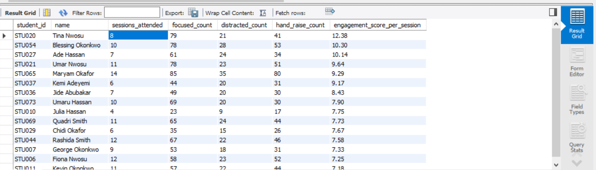
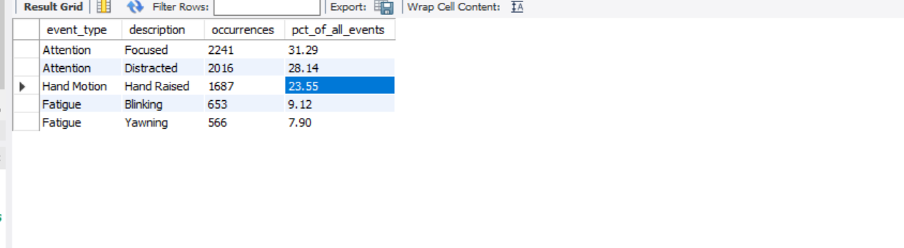
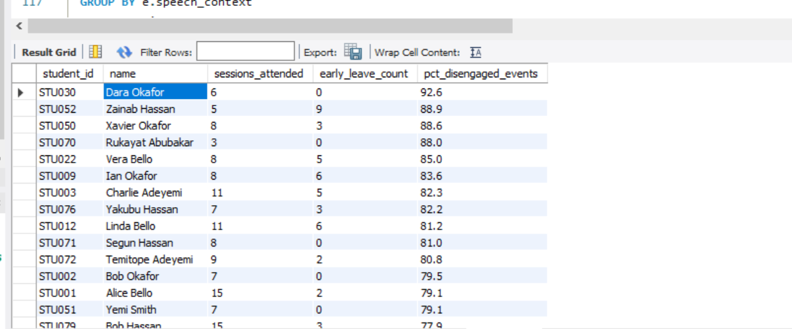
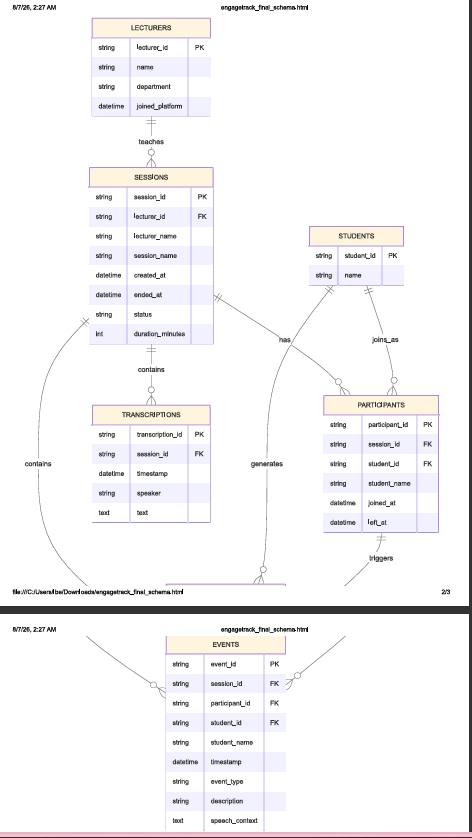

# EngageTrack Data Analytics

> SQL-powered analytics on classroom engagement data from **EngageTrack** — a real-time student engagement tracking system built for online/hybrid learning environments.

---

## 📌 Project Overview

This project analyzes engagement signals captured by the [EngageTrack](https://github.com/favibe/EngageTrack) platform, which I designed myself. 
Making the entire analytics workflow from application design to business insight—fully reproducible. It includes attention states, hand raises, and fatigue indicators — to answer two core questions:

1. **Classroom Engagement:** How are students behaving during lectures? Who is engaged? Who is at risk?
2. **Product Analytics:** How is the EngageTrack platform being used? Which lecturers are power users? Where is growth potential?

---

## 🗂️ Dataset

### Tables

| Table | Rows | Description |
|-------|------|-------------|
| `lecturers` | 10 | Lecturers/admins who create sessions |
| `students` | 80 | Unique students enrolled |
| `sessions` | 50 | Class sessions (Sep–Nov 2025) |
| `participants` | 700 | Student-session attendance records |
| `events` | ~7,200 | Engagement signals (Attention, Hand Motion, Fatigue) |
| `transcriptions` | ~1,200 | Timestamped speech from sessions |

### Event Types Tracked

| Event Type | Description | What It Tells Us |
|------------|-------------|------------------|
| **Attention** | Focused | Student is paying attention |
| **Attention** | Distracted | Student is looking away |
| **Hand Motion** | Hand Raised | Student is participating |
| **Fatigue** | Yawning | Student is tired |
| **Fatigue** | Blinking | Student is drowsy |

---

## 🔧 Tech Stack

- **Database:** MySQL 8.0
- **Data Generation:** Python (Faker, Pandas)
- **Analysis:** SQL (window functions, CTEs, aggregations)

---

## 📊 Key Visuals

### Top Engaged Students

*Students ranked by engagement score (focused - distracted + hand raises per session). Tina Nwosu leads with 12.38.*

### Event Type Distribution

*Only 31% of events show students focused. 28% distracted. This signals a need for more interactive teaching methods.*

### At-Risk Students

*Dara Okafor shows 92.6% disengaged events — immediate intervention recommended.*

### Database Schema


*Relational schema connecting lecturers, sessions, students, participants, events, and transcriptions.*

---

## 🔑 Key Findings

### Track A: Classroom Engagement Insights

| Finding | Insight | Action for Lecturers |
|---------|---------|---------------------|
| **Best Lecturer:** Dr. Chioma Adeyemi (34.7% focused) | Her teaching style keeps students most attentive | Share her methods with others |
| **Worst Lecturer:** Prof. James Smith (27.7% focused) | Students drift most in his classes | Coaching recommended |
| **Short sessions = MORE fatigue** | ≤45 min sessions had 21.7% fatigue vs 15.8% for 150+ min | Don't rush — longer sessions with breaks work better |
| **First 15 minutes are critical** | Distraction peaks at minute 0 (30.6%) | Start with an engaging hook |
| **Engagement is flat across sessions** | No "death by PowerPoint" drop-off at the end | Lecturers maintain consistency well |
| **Most Improved:** Maryam Okafor (+24) | Went from barely engaged to highly engaged | Success story — replicate what worked |
| **Worst Session:** UI/UX Design Week 1 (59.2% disengaged) | UI/UX Design is a problem course | Review content delivery for this subject |

### Track B: Product Analytics Insights

| Finding | Insight | Action for Product Team |
|---------|---------|------------------------|
| **Power User:** Prof. Ibrahim Mohammed (10 sessions, 885 min) | Most active lecturer | Feature him as a case study |
| **Computer Science dominates** | 70% of all sessions (35/50) | IT department is untapped — target for growth |
| **Sessions getting 47% longer** | Avg duration grew from 90 to 132 min over semester | Lecturers are cramming — consider "session health" alerts |
| **100% student retention** | Every student who attended once came back | Strong product-market fit in academic setting |

---

## 🚀 How to Reproduce

### 1. Create Database
```sql
CREATE DATABASE engagetrack_data_analytics;
USE engagetrack_data_analytics;
```

### 2. Run Schema
```bash
mysql -u your_username -p engagetrack_data_analytics < sql/01_schema.sql
```

### 3. Import Data
Use MySQL Workbench Table Data Import Wizard or:
```sql
LOAD DATA INFILE '/path/to/events.csv' INTO TABLE events
FIELDS TERMINATED BY ',' IGNORE 1 ROWS;
```

### 4. Run Analysis
```sql
SOURCE sql/analysis_queries.sql;
SOURCE sql/extended_analysis.sql;
```

### 5. Regenerate Data (Optional)
```bash
python scripts/generate_synthetic_data.py
```

---

## 🏆 Skills Demonstrated

- **Database Design:** Normalized schema with foreign keys, indexes, and proper data types
- **SQL Proficiency:** CTEs, window functions (`RANK()`, `NTILE()`), `CASE` expressions, `TIMESTAMPDIFF`, `YEARWEEK()`
- **Data Modeling:** Synthetic data generation with realistic distributions and relationships
- **Business Analysis:** Translating raw engagement signals into actionable insights for educators
- **Product Thinking:** Analyzing platform usage patterns, retention, and growth opportunities

---

## 📬 Contact

Built by [Favour Ibe] as part of the EngageTrack analytics portfolio.

- GitHub: [@favibe](https://github.com/favibe)
- Portfolio: [Behance](https://behance.net/ibefavour)

---

> *"Data is only valuable when it drives action. These insights help lecturers teach better and help the product team grow smarter."*
